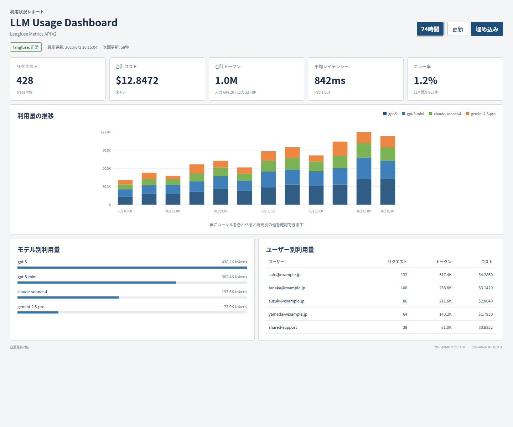

# SPS Dashboard

Langfuse Metrics API v2の利用状況を、SharePoint Server 2013のPage Viewer Web Partからiframe表示できる動的ダッシュボードです。APIキーはバックエンドだけが保持し、ブラウザやSharePointへ公開しません。

## 表示項目

- リクエスト数（distinct trace）
- 合計コスト
- 入力・出力・合計トークン
- 平均およびP95レイテンシー
- エラー率
- モデル別の積み上げ時系列推移（24時間は0件の時間帯を含む時間別、7日以上は日別）
- モデル別利用量
- ユーザー別利用量

## 起動

```bash
cp .env.example .env
# .envのLangfuseキー、ホスト、SharePointオリジンを編集
docker compose up -d --build
```

Podmanの場合：

```bash
podman compose up -d --build
```

または、Docker/Podmanを自動判定するスクリプトを利用できます。

```bash
./run.sh
# 明示する場合: CONTAINER_ENGINE=podman ./run.sh
```

既定のURLは `http://<dashboard-host>:8090/`、ヘルスチェックは `/healthz`、API仕様は `/api/docs` です。

## `.env` の要点

```dotenv
LANGFUSE_HOST=http://host.docker.internal:3000
LANGFUSE_PUBLIC_KEY=pk-lf-...
LANGFUSE_SECRET_KEY=sk-lf-...
DASHBOARD_REFRESH_SECONDS=60
FRAME_ANCESTORS='self' http://sps.example.local
```

Linux上のDockerではComposeが `host.docker.internal` をホストゲートウェイへ割り当てます。Langfuseが別ホストにある場合は、SPS Dashboardコンテナから到達可能なURLを直接指定してください。

## SharePoint Server 2013への設置

ダッシュボード右上の **埋め込み** ボタンを押すと、現在の公開URLを使ったiframeコードを生成・コピーできます。`localhost` は同じPCからしか到達できないため、SPSからアクセスできるホスト名またはIPアドレスでダッシュボードを開いてから生成してください。

1. SPSからダッシュボードURLへ到達できることを確認します。
2. `.env` の `FRAME_ANCESTORS` にSPSサイトのオリジンを追加して再起動します。
3. SharePointページを編集し、Media and Contentの **Page Viewer Web Part** を追加します。
4. Web Pageとして `http(s)://<dashboard-host>:8090/` を指定します。
5. 高さを700～900px程度に設定します。

SPSがHTTPSの場合、ブラウザのMixed Content制限を避けるためダッシュボードもHTTPSで公開してください。本番環境ではNginx、IIS、ロードバランサー等でTLS終端する構成を推奨します。

## SharePoint Onlineへの将来移行

同じURLをSPOのEmbed Webパーツで利用できます。SPOのドメインを `FRAME_ANCESTORS` に追加し、HTTPSで公開してください。必要になれば本UIをSPFx Webパーツに包むこともできますが、APIと画面の再実装は不要です。

## データソースの拡張

プロバイダーは `app/providers/` に分離されています。Grafana、Prometheus、Azure Monitor等は `DashboardProvider` と同じ正規化モデルを返すプロバイダーとして追加できます。APIキー等は各プロバイダー専用の環境変数へ格納します。

リクエスト数とユーザーはTraces APIを正として集計します。モデル、トークン、コスト、レイテンシーはLangfuse v4画面と同様にLLM関連Observation（GENERATION、AGENT、TOOL、CHAIN、RETRIEVER、EVALUATOR、EMBEDDING、GUARDRAIL）だけをMetrics API v2で集計します。高カーディナリティの `userId` はMetrics API v2でグルーピングできないため、Traces APIとObservations API v2をページングしてサーバー側で集計します。`LANGFUSE_MAX_OBSERVATIONS` を超える場合、画面へpartial/degradedとして表示します。

LiteLLM等のOTel exporterが `x-langfuse-ingestion-version: 4` を送信しない場合、Metrics API v2への反映が最大約10分遅れることがあります。画面の自動更新間隔とは別の遅延です。

## 開発とテスト

```bash
python -m venv .venv
. .venv/bin/activate
pip install -r requirements-dev.txt
pytest
uvicorn app.main:app --reload --port 8090
```

APIキーなしで画面を確認する場合は、モックデータサーバーを起動します。

```bash
python -m scripts.mock_server
```



## セキュリティ

- `.env` はGit管理対象外です。
- Langfuse APIキーをフロントエンドへ返しません。
- iframe許可先は `FRAME_ANCESTORS` で限定してください。
- アプリは非root、read-only filesystem、`no-new-privileges` で実行します。
- アプリ自身は利用者認証を行いません。SPS利用者だけが到達できるネットワークへ配置するか、IIS/Nginx等のリバースプロキシでWindows認証・OIDC等を付与してください。
